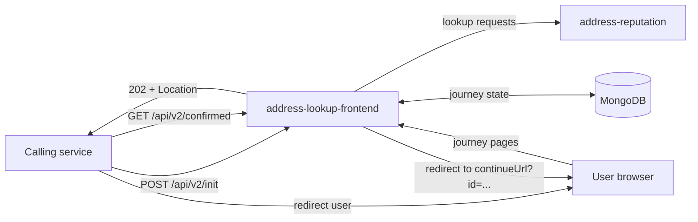
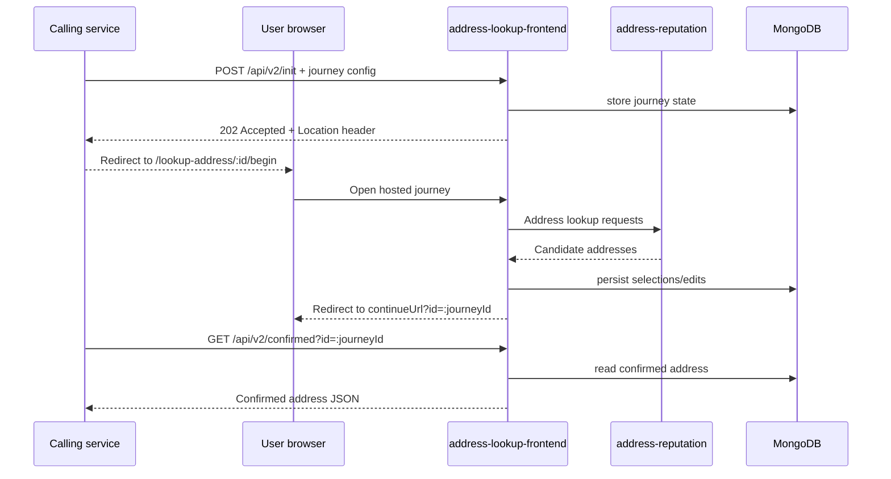
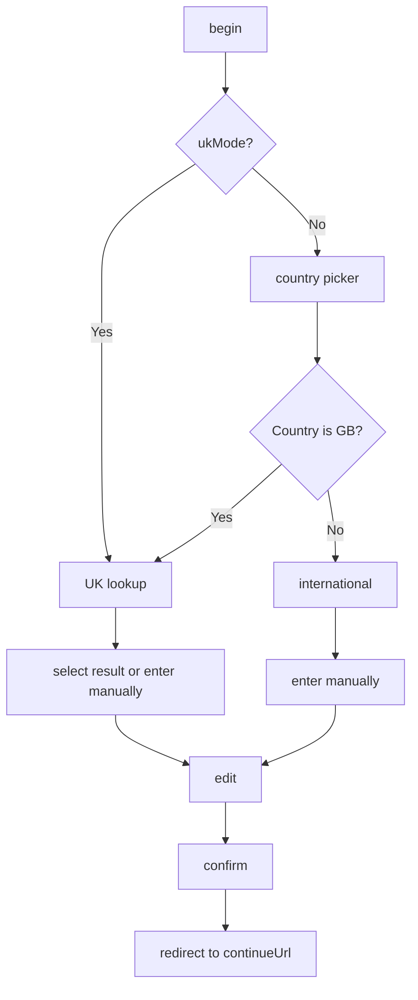

# Address Lookup Frontend

`address-lookup-frontend` is a Play Framework microservice that hosts reusable address capture journeys for HMRC services.

It provides:

- UK postcode lookup backed by `address-reputation`
- international address lookup and manual entry
- configurable manual address entry forms
- English and Welsh journeys
- Mongo-backed journey state with a 60 minute TTL

## Architecture overview



## How it works

From the calling service's point of view, the flow is:

1. `POST /api/v2/init` with a journey configuration JSON payload.
2. Receive `202 Accepted` with a `Location` header.
3. Redirect the user to that `Location`.
4. The user completes the hosted journey under `/lookup-address/:id/...`.
5. The user is redirected back to your `continueUrl` with `?id=<journeyId>` appended.
6. Fetch the confirmed address with `GET /api/v2/confirmed?id=<journeyId>`.

Versionless endpoints (`/api/init` and `/api/confirmed`) are still available for backward compatibility.

### Integration sequence



### Journey decision flow



## Routes

### Public API

| Method | Path | Purpose |
| --- | --- | --- |
| `POST` | `/api/v2/init` | Initialise a journey |
| `GET` | `/api/v2/confirmed?id=...` | Fetch the confirmed address |
| `POST` | `/api/init` | Compatibility alias for `v2/init` |
| `GET` | `/api/confirmed?id=...` | Compatibility alias for `v2/confirmed` |

### User journey routes

The UI is mounted under `/lookup-address` and includes:

- `/:id/begin`
- `/:id/country-picker`
- `/:id/lookup`, `/:id/select`, `/:id/edit`, `/:id/confirm`
- `/:id/international/lookup`, `/:id/international/select`, `/:id/international/edit`, `/:id/international/confirm`

## Initialising a journey

`POST /api/v2/init`

- Request body: `application/json`
- Success: `202 Accepted`
- Response header: `Location: http://.../lookup-address/:id/begin`

Journeys are stored in MongoDB for 60 minutes by default.

### Example request

```json
{
  "version": 2,
  "options": {
    "continueUrl": "http://localhost:3000/return-from-address-lookup",
    "serviceHref": "/my-service",
    "signOutHref": "/sign-out",
    "accessibilityFooterUrl": "/accessibility-statement/my-service",
    "showBackButtons": true,
    "disableTranslations": false,
    "includeHMRCBranding": true,
    "ukMode": false,
    "allowedCountryCodes": ["GB", "FR", "DE"],
    "selectPageConfig": {
      "proposalListLimit": 50,
      "showSearchAgainLink": true,
      "showNoneOfTheseOption": false
    },
    "confirmPageConfig": {
      "showSearchAgainLink": true,
      "showSubHeadingAndInfo": true,
      "showChangeLink": true,
      "showConfirmChangeText": true
    },
    "manualAddressEntryConfig": {
      "line1MaxLength": 100,
      "line2MaxLength": 100,
      "line3MaxLength": 100,
      "townMaxLength": 100,
      "mandatoryFields": {
        "addressLine1": true,
        "town": true,
        "postcode": true
      },
      "maxLengthErrorMessages": {
          "en": {
             "addressLine1": "Custom error message for address line 1",
             "addressLine2": "Custom error message for address line 2",
             "addressLine3": "Custom error message for address line 3",
             "town": "Custom error message for town"
          },
          "cy": {
             "addressLine1": "Custom error message for address line 1 - Welsh",
             "addressLine2": "Custom error message for address line 2 - Welsh",
             "addressLine3": "Custom error message for address line 3 - Welsh",
             "town": "Custom error message for town - Welsh"
          }
      },
      "showOrganisationName": true
    },
    "timeoutConfig": {
      "timeoutAmount": 900,
      "timeoutUrl": "/timeout",
      "timeoutKeepAliveUrl": "/keep-alive"
    },
    "pageHeadingStyle": "govuk-heading-xl"
  },
  "labels": {
    "en": {
      "lookupPageLabels": {
        "title": "Find your address",
        "heading": "Find your address",
        "submitLabel": "Find address"
      },
      "confirmPageLabels": {
        "heading": "Review and confirm",
        "submitLabel": "Confirm address"
      },
      "international": {
        "editPageLabels": {
          "townLabel": "City",
          "postcodeLabel": "Postal code"
        }
      }
    },
    "cy": {
      "lookupPageLabels": {
        "title": "Dewch o hyd i'ch cyfeiriad",
        "heading": "Dewch o hyd i'ch cyfeiriad"
      }
    }
  }
}
```

### Example `curl`

```bash
curl -i \
  -X POST http://localhost:9028/api/v2/init \
  -H 'Content-Type: application/json' \
  -d @journey-config.json
```

## Journey configuration reference

Only `version` and `options.continueUrl` are always required. Everything else is optional and can be omitted unless you need to override the default behaviour.

### Top-level payload

| Field | Required | Notes |
| --- | --- | --- |
| `version` | Yes | Use `2` |
| `options` | Yes | Journey behaviour and UI options |
| `labels` | No | Per-language content overrides |
| `requestedVersion` | No | Optional compatibility field |

### `options`

| Field | Required | Notes |
| --- | --- | --- |
| `continueUrl` | Yes | URL the user is sent back to after confirmation |
| `homeNavHref` | No | Header home link override |
| `serviceHref` | No | Service name link override |
| `signOutHref` | No | Sign out URL; must be relative or on the allow list |
| `accessibilityFooterUrl` | No | Accessibility statement link override |
| `phaseFeedbackLink` | No | Defaults to HMRC ALF feedback URL |
| `deskProServiceName` | No | Defaults to `AddressLookupFrontend` |
| `showPhaseBanner` | No | Defaults to `false` |
| `alphaPhase` | No | Defaults to `false`; used with `showPhaseBanner` |
| `showBackButtons` | No | Defaults to `true` |
| `disableTranslations` | No | Defaults to `false`; set `true` to force English only |
| `includeHMRCBranding` | No | Defaults to `true` |
| `ukMode` | No | Defaults to `false`; when `true`, restricts journeys to UK addresses |
| `allowedCountryCodes` | No | Restricts countries shown in manual entry |
| `selectPageConfig` | No | Select page behaviour |
| `confirmPageConfig` | No | Confirm page behaviour |
| `manualAddressEntryConfig` | No | Manual entry validation and field behaviour |
| `timeoutConfig` | No | Timeout dialog configuration |
| `pageHeadingStyle` | No | Defaults to `govuk-heading-xl` |

### `selectPageConfig`

| Field | Required | Notes |
| --- | --- | --- |
| `proposalListLimit` | No | Defaults to `100` |
| `showSearchAgainLink` | No | Defaults to `false` |
| `showNoneOfTheseOption` | No | If omitted entirely, the service can use an environment default; set explicitly for predictable behaviour |

### `confirmPageConfig`

| Field | Required | Notes |
| --- | --- | --- |
| `showSearchAgainLink` | No | Defaults to `false` |
| `showSubHeadingAndInfo` | No | Defaults to `false` |
| `showChangeLink` | No | Defaults to `true` |
| `showConfirmChangeText` | No | Defaults to `false` |

### `manualAddressEntryConfig`

| Field | Required | Notes |
| --- | --- | --- |
| `line1MaxLength` | No | Default `255`; valid range `35` to `255` |
| `line2MaxLength` | No | Default `255`; valid range `35` to `255` |
| `line3MaxLength` | No | Default `255`; valid range `35` to `255` |
| `townMaxLength` | No | Default `255`; valid range `35` to `255` |
| `mandatoryFields` | No | Controls which manual-entry fields are required |
| `maxLengthErrorMessages` | No | Optional custom validation messages by language |
| `showOrganisationName` | No | Defaults to `true` |

`mandatoryFields` supports the following Boolean flags:

- `addressLine1`
- `addressLine2`
- `addressLine3`
- `town`
- `postcode`

If you provide `maxLengthErrorMessages`, supply a complete set of messages for each language you override. For example, if you override English, include messages for `addressLine1`, `addressLine2`, `addressLine3`, and `town`.

### `timeoutConfig`

| Field | Required | Notes |
| --- | --- | --- |
| `timeoutAmount` | Yes, when `timeoutConfig` is present | Minimum value `120` seconds |
| `timeoutUrl` | Yes, when `timeoutConfig` is present | Must be relative or on the allow list |
| `timeoutKeepAliveUrl` | No | Must be relative or on the allow list |

## Labels and localisation

Welsh support is enabled by default. When translations are enabled:

- users can switch between English and Welsh
- Welsh content is shown when the `PLAY_LANG=cy` cookie is present
- you can optionally override both `en` and `cy` labels in the init payload

Set `disableTranslations` to `true` if your calling service does not want Welsh content or the language toggle.

### Label groups

Under each language key (`en` and optionally `cy`), the following groups are supported:

- `appLevelLabels`
- `countryPickerLabels`
- `lookupPageLabels`
- `selectPageLabels`
- `confirmPageLabels`
- `editPageLabels`
- `international`

For non-UK journeys, `international` can contain page-specific overrides such as:

- `international.lookupPageLabels`
- `international.selectPageLabels`
- `international.editPageLabels`
- `international.confirmPageLabels`

`lookupPageLabels` and `editPageLabels` also support UK-mode-specific overrides such as `titleUkMode`, `headingUkMode`, and `postcodeLabelUkMode`.

## Confirmed address response

After the user confirms their address, your `continueUrl` receives `?id=<journeyId>`. Use that ID to call `GET /api/v2/confirmed?id=<journeyId>`.

### Example response

```json
{
  "auditRef": "bed4bd24-72da-42a7-9338-f43431b7ed72",
  "id": "GB990091234524",
  "address": {
    "lines": ["10 Other Place", "Some District", "Anytown"],
    "postcode": "ZZ1 1ZZ",
    "country": {
      "code": "GB",
      "name": "United Kingdom"
    }
  }
}
```

If the user entered the address manually, or edited a selected address, the `id` field may be absent.

## Testing your own service against ALF

For journey tests in a consuming service, it is usually better to stub ALF rather than drive the full UI.

Recommended stubs:

1. `POST /api/v2/init`
   - return `202 Accepted`
   - include a `Location` header that points back to your test journey with a fake journey ID
2. `GET /api/v2/confirmed?id=...`
   - return `200 OK`
   - return a JSON body matching the confirmed address shape above

This keeps your tests fast and avoids coupling them to ALF page structure.

## Local development

### Prerequisites

- MongoDB running locally
- `sbt`
- the supporting address lookup services, if you want real address search behaviour

If you need MongoDB setup instructions, see the MDTP handbook:

https://docs.tax.service.gov.uk/mdtp-handbook/documentation/developer-set-up/set-up-mongodb.html

### Start dependencies

```bash
sm2 --start ADDRESS_LOOKUP_SERVICES
sm2 --stop ADDRESS_LOOKUP_FRONTEND
```

### Run the service locally

Standard local run with test routes enabled:

```bash
./run-local.sh
```

Equivalent direct command:

```bash
sbt "run 9028 -Dplay.http.router=testOnlyDoNotUseInAppConf.Routes"
```

UI-test variant with `showNoneOfTheseOption` forced on:

```bash
./run-local-for-ui-test.sh
```

With the test router enabled, you can initialise journeys from:

http://localhost:9028/lookup-address/test-only/v2/test-setup

## Tests

### Unit tests

```bash
sbt test
```

### Integration tests

```bash
sbt it/test
```

### Code coverage

```bash
sbt clean coverage test it/test coverageReport
```

### Dependency updates

```bash
sbt ";dependencyUpdates; reload plugins; dependencyUpdates"
```

## Tech stack

- Scala `3.3.7`
- Play Framework
- HMRC bootstrap frontend
- `hmrc-mongo-play` for journey persistence
- Twirl templates

The service listens on port `9028` by default.

## License

This code is open source software licensed under the [Apache 2.0 License](LICENSE).
